<p align="center">
  
</p>

<p align="center">
  <a href="https://linkedin.com/in/trystan-legrand-simon">
    
  </a>
  <a href="https://instagram.com/hackee_fr">
    
  </a>
  <a href="https://tiktok.com/@hackee_fr">
    
  </a>
  <a href="https://twitch.tv/hackee_fr">
    
  </a>
</p>

> Ce profil est rédigé comme un rapport de pentest. La cible, c'est moi.

## Phase 1 : Reconnaissance

```yaml
cible:        Trystan
poste:        Apprenti cybersécurité / sysadmin @ Thales
formation:    Master Expert en Cybersécurité (Pentester) @ Ynov Connect
localisation: France
objectif:     Pentest, Red Team, AI Red Teaming
```

```diff
- chauffeur poids lourd / super poids lourd
+ autodidacte en développement web
+ EPITECH, BTS dev web, Bachelor admin. d'infrastructures sécurisées
+ apprenti cybersécurité chez Thales
+ futur pentester / red teamer
```

## Phase 2 : Énumération

```
PORT      STATE   SERVICE          VERSION
22/tcp    open    infra            Proxmox, Docker, Traefik, Coolify, Ansible/AWX, k3s,
                                   Hyper-V, Windows Server, Rocky Linux, Ubuntu
443/tcp   open    dev              Next.js, TypeScript, React, Express, PostgreSQL,
                                   Prisma, Drizzle, Better Auth, Tailwind, Python
1337/tcp  open    sécurité         Kali Linux, Wazuh SIEM, OPNsense, VLAN, Zabbix, Veeam
8080/tcp  open    automatisation   agents IA, Claude Code, bots Discord
```

## Phase 3 : Exploitation

| Projet | Ce que ça fait | Stack |
|---|---|---|
| **Agents pentest** | Des agents Claude Code pilotent Kali Linux dans Docker, commandés depuis Discord | Claude Code, Docker, Kali |
| **Homelab** | Proxmox multi-VLAN derrière OPNsense, supervisé par un SIEM Wazuh | Proxmox, OPNsense, Wazuh |
| **Lab OPNsense** | Un second lab sous Hyper-V avec DMZ et segmentation réseau | Hyper-V, OPNsense |
| **DevDocs** | Un CMS pour ranger et retrouver ma documentation technique | Next.js, TypeScript |
| **CRM** | Un CRM sur mesure, de l'auth à la base de données | Next.js, PostgreSQL, Better Auth |

## Phase 4 : Persistance

```
[+] intégrer le pôle pentest chez Thales
[+] valider le Master Expert en Cybersécurité
[+] me spécialiser en red team et en sécurité des IA
[*] en cours...
```

<p align="center">
  <picture>
    <source media="(prefers-color-scheme: dark)" srcset="https://raw.githubusercontent.com/Trystan-LegrandSimon/Trystan-LegrandSimon/output/snake-dark.svg" />
    
  </picture>
</p>

```
[*] fin du rapport. aucune vulnérabilité critique, beaucoup de motivation.
```
